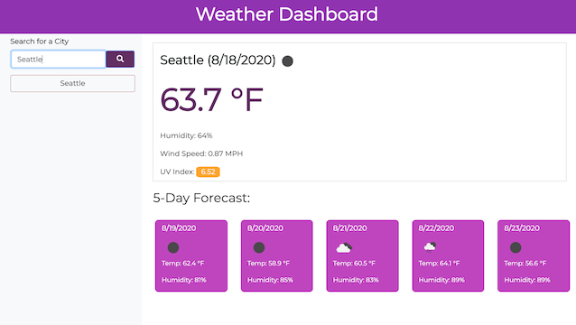

# [Weather-Dashboard](https://sdemkovich.github.io/Weather-Dashboard/)

## Description

This application allows the user to retrieve weather data for cities using OpenWeather API.  
Search for a city, and dashboard will display current 
conditions include temperature, humidity,  
wind speed and UV index (with severity) for the current day of that city. Additionally, the 5 day forecast will display.  
When the user searches for a city, it is added to their search history and a button is created that the user may click on to revisit the conditions for that city.

## Table of Contents
* [Usage](#usage)
* [Technologies](#technologies)
* [Questions](#questions)

## Usage
* Enter a city name into the search bar and press search button
* View current weather conditions and 5-days weather forecast for that city
* Click on a city in your search history to be see that city's weather data

## Technologies
* HTML
* CSS
* JavaScript
* jQuery
* Open Weather Maps API
* Moment.js

## Questions
​
If you have any questions about the repo, please contact me:

On GitHub: [sdemkovich](https://github.com/sdemkovich) 